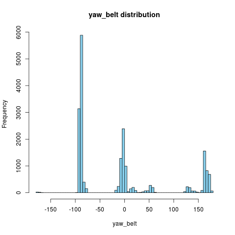

Prediction of Correct Weight Lifting Activity from Sensors data
===============================================================

```{r echo=FALSE}
source("predict.R")
```

**The main R code is not in the .Rmd file but rather in the predict.R file**

Data pre-processing
-------------------

The data set was first pre-processed for cleaning :

* empty values or values set at #DIV/0! were changed to NA.
* for each feature, the percentage of occurrences of NA was assessed and all features having more than 95% of their values undetermined were discarded
* all remaining features had no undetermined values
* some features were also discarded since they are essentially technical and do not represent predicting features. These columns are raw_timestamp_part_1, raw_timestamp_part_2, cvtd_timestamp, new_window and num_window. In fact, some of them (num_window and cvtd_timestamp) might even have correlations with the class to predict because of the protocol and their inclusion might lead to biaised predictions.

This lead to 52 features. Since many (but not all) of the features have multi-modal (sometimes near discrete) values (see for instance figure 1 below as an example), no attempt was made to normalize the data (compute z-values).

<center></center>

<center>figure 1</center>

Prediction
----------

The resulting data set was then split into two sets :

* a training set representing 70% of the cases.
* a test set representing 30% of the cases (independant of the final test set to use in the submission).

A random forest algorithm was used to train the model using the following code :
```
trainCtrl <- trainControl(method = "oob")
model <- train(classe ~ ., data = frTrain, method = "rf", trControl = trainCtrl, tuneLength = 5, ntree = 200)
```

200 trees was a good compromise between the speed of execution and the accuracy of the results (increasing this value did not help).

The model was tested using the test set and a good accuracy was obtained. Here is the confusion matrix obtained with prediction in line and reference in column.

```{r echo=FALSE, results='asis'}
library(xtable)
load("data.rda")
print(xtable(cm$table), type = "html")
```

The overall out of sample accuracy was `r cm$overall["Accuracy"]` (thus error rate of `r 1 - cm$overall["Accuracy"]`) and the sensitivity, specificity, PPV and NPV by class were the following :

```{r echo=FALSE, results='asis'}
library(xtable)
print(xtable(cm$byClass[, c("Sensitivity", "Specificity", "Pos Pred Value", "Neg Pred Value")]), type = "html")
```


